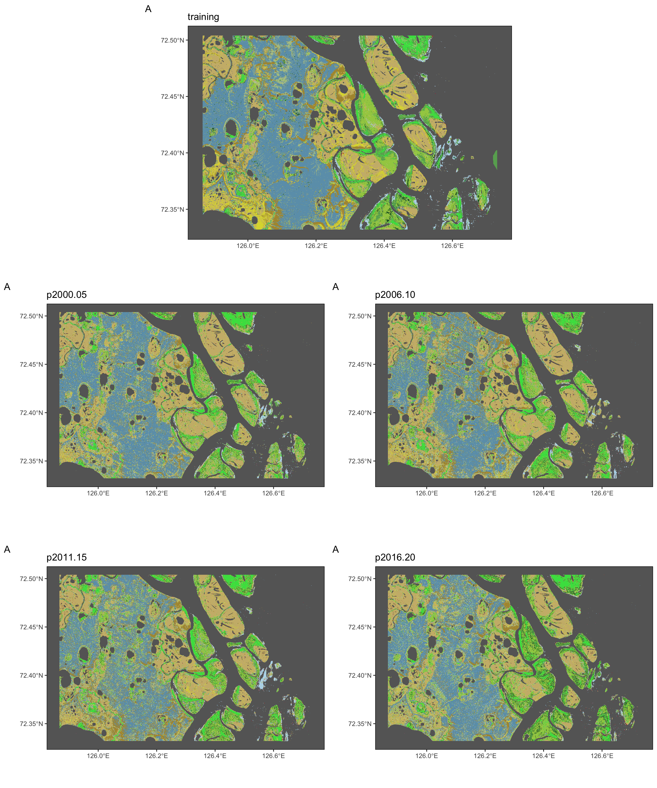
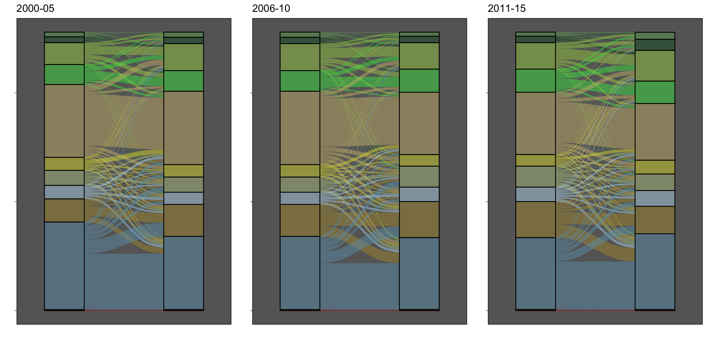

<style type="text/css">
.main-container {
  max-width: 1400px;
  margin-left: auto;
  margin-right: auto;
}
</style>

<details>
  <summary>Code</summary>
```{r, eval = FALSE}
library(stars)
library(sf)
library(tidyverse)
library(ggalluvial)
library(gridExtra)

library(rgee)
ee_Initialize()
roi     <- ee_as_sf(ee$FeatureCollection("users/slisovski/LenaDeltaHabitatClasses/LenaDeltaROI"))

fls <- list.files("~/Documents/ClassesTrend/", pattern = "*.tif", full.names = T)
str <- read_stars(fls, quiet = TRUE, proxy = TRUE) %>% merge()

sam   <- st_as_sfc(st_bbox(c(xmin = 125.867165, xmax = 126.731148, ymin = 72.331738, ymax = 72.503998))) %>% st_set_crs(st_crs(roi))

classCol <- c('#68ab5f', '#1c5f2c', '#a3cc51', '#43DF4F', '#ccb879',
              '#dcd939', '#b5c58f', '#b8d9eb', '#af963c', '#6c9fb8',
              '#d2042d', 'transparent', 'transparent')

### training
train <- read_stars("Output/Sentinel_classes_mosaic.tif", proxy = TRUE) %>%
          st_crop(sam %>% st_set_crs(st_crs(str))) %>% st_as_stars()

dyn   <- str[sam %>% st_intersection(roi),] %>% st_as_stars()

dset  <- c(st_warp(train, split(dyn[,,,1])) %>% setNames("training"), 
           split(dyn) %>% setNames(c("p2000-05", "p2006-10", "p2011-15", "p2016-20"))) %>%
            merge()


t <- split(chkR) %>% as_tibble() %>% select(-x, -y) %>% 
        setNames(c("2000", "2006", "2011", "2016")) %>% filter(!is.na(`2000`))


mps <- lapply(1:dim(dset)[3], function(x) {
  
  sP <- ggplot(sam) +
    geom_sf(fill = "transparent", color = "transparent") +
    geom_stars(data = dset[,,,x], show.legend = FALSE) +
    scale_fill_gradientn(colors = classCol, breaks = 0:12, na.value = "transparent") +
    scale_color_manual(values = classCol[1:11]) +
    labs(x = "", y = "",
         title = names(split(dset))[x],
         tag = "A") +
    theme(
      panel.grid.major = element_blank(), panel.grid.minor = element_blank(),
      panel.background = element_rect(fill = "grey40",
                                      colour = "grey40"),
      panel.border = element_rect(colour = "black", fill = "transparent"),
      panel.grid = element_line(size = 0.08)
    )  +
    coord_sf(
      xlim = c(st_bbox(sam)["xmin"], st_bbox(sam)["xmax"]),
      ylim = c(st_bbox(sam)["ymin"], st_bbox(sam)["ymax"])
    )
  
})

png(glue::glue("DynClasses.png"), width = 2500, height = 1000*3, res = 200)
# do.call("grid.arrange", c(mps, ncol = 1))
grid.arrange(arrangeGrob(mps[[1]], ncol = 1, heights = 1000),                             
             arrangeGrob(mps[[2]], mps[[3]], ncol = 2, heights = 1000),
             arrangeGrob(mps[[4]], mps[[5]], ncol = 2, heights = 1000),
             ncol = 1)  
dev.off()
```
</details><br/> 



**Do we need to train each period seperately - how?**


<details>
  <summary>Code</summary>
```{r, eval = FALSE}
t <- split(dyn) %>% as_tibble() %>% select(-x, -y) %>% 
  setNames(c("2000", "2006", "2011", "2016")) %>% filter(!is.na(`2000`))

years <- c("2000-05", "2006-10", "2011-15", "2016-20")

k <- lapply(split(tibble(st = 1:3, end = 2:4), 1:3), function(x) {
       tab <- t[,unlist(c(x[1],x[2]))] %>% setNames(c("start", "end")) %>% unite(fluv, c("start", "end")) %>%
                 group_by(fluv) %>% summarise(count = n()) %>% mutate(start = sub("_.*", "", fluv), end = sub(".*_", "", fluv)) %>%
                 select(-fluv) %>% rownames_to_column("row_names") %>% pivot_longer(cols = c("start", "end")) %>% mutate(value = as.factor(as.numeric(value))) %>%
                 filter(value%in%c(0:10)) %>% mutate(name = ifelse(name=="start", unlist(x[1]), unlist(x[2])))
  
        ggplot(tab,
               aes(x    = name, stratum = value, alluvium = row_names,
                   y    = count,
                   fill = value, label = value)) +
          scale_fill_manual(values = classCol[1:11])  +
          scale_x_discrete(expand = c(.1, .1)) +
          geom_flow(show.legend = F) +
          geom_stratum(alpha = .5, show.legend = F) + 
          theme_dark() +
          labs(x = "", y = "",
               title = years[unlist(x[1,1])]) +
          theme(
            axis.text.y = element_blank(),
            panel.grid.major = element_blank(), panel.grid.minor = element_blank(),
            panel.background = element_rect(fill = "grey40",
                                            colour = "grey40"),
            panel.border     = element_rect(colour = "black", fill = "transparent"),
            panel.grid       = element_line(size = 0.08)
          )
        
     })


png("Fluvials.png", width = 2500, height = 1200, res = 200)
do.call("grid.arrange", c(k, ncol = 3))   
dev.off()
```
</details><br/> 


