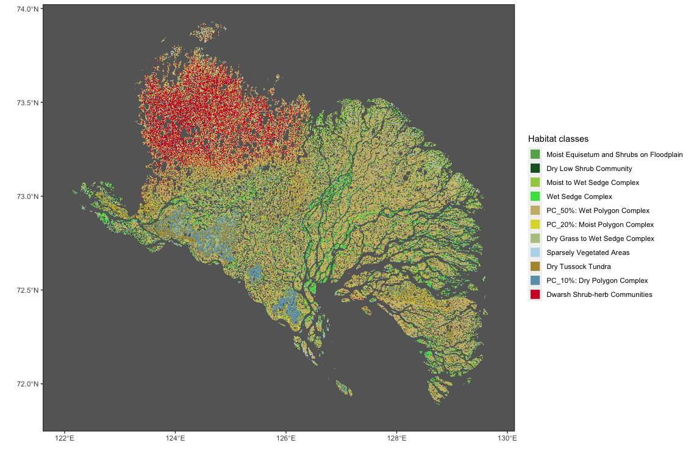
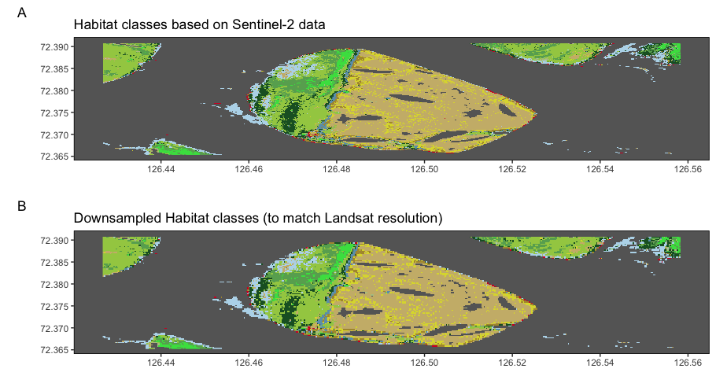

<style type="text/css">
.main-container {
  max-width: 1400px;
  margin-left: auto;
  margin-right: auto;
}
</style>


Methods, training, etc.: [Google Earth Engine](https://code.earthengine.google.com/?scriptPath=users%2Fslisovski%2FLenaDeltaHabitatClasses%3AClassification_LenaDelta_2018)

Visualisation: [Google Earth Engine](https://code.earthengine.google.com/?scriptPath=users%2Fslisovski%2FLenaDeltaHabitatClasses%3AClasses_visualisation)

<details>
  <summary>R Library</summary>
```{r libraries, message=FALSE, warning=FALSE,  results=FALSE}
  library(stars)
  library(raster)
  library(tidyverse)
  library(sf)
  sf::sf_use_s2(FALSE)
```
</details><br/> 

<details>
  <Habitat Classes Map>R Library</summary>
```{r, eval = FALSE}
load("data/tmp/roi.rda")

classesR <- read_stars("data/Landsat_classes_index.tif") %>% 
  setNames("Habitat") %>% st_set_dimensions(names = c("x", "y", "band")) %>% st_as_stars()

classCol <- c('#68ab5f', '#1c5f2c', '#a3cc51', '#43DF4F', '#ccb879',
              '#dcd939', '#b5c58f', '#b8d9eb', '#af963c', '#6c9fb8',
              '#d2042d', 'transparent', 'transparent')

classNms <- c('Moist Equisetum and Shrubs on Floodplain',
              'Dry Low Shrub Community',
              'Moist to Wet Sedge Complex',
              'Wet Sedge Complex',
              'PC_50%: Wet Polygon Complex',
              'PC_20%: Moist Polygon Complex',
              'Dry Grass to Wet Sedge Complex',
              'Sparsely Vegetated Areas',
              'Dry Tussock Tundra',
              'PC_10%: Dry Polygon Complex',
              'Dwarsh Shrub-herb Communities')


ggplot(roi) +
  geom_sf(fill = "transparent", color = "transparent") +
  geom_stars(data = classesR[,,,1], downsample = c(11,11), show.legend = FALSE) +
  scale_fill_gradientn(colors = classCol, breaks = 0:12, na.value = "transparent") +
  geom_point(data.frame(x = 0:10, y = rep(0, 11), cl = as.factor(0:10)), mapping = aes(x, y, col = cl[1:11])) +
  scale_color_manual(name = "Habitat classes", values = classCol[1:11], labels = classNms, 
                     guide = guide_legend(override.aes = list(size = 5, shape = 15))) +
  labs(x = "", y = "") +
  theme(
    panel.grid.major = element_blank(), panel.grid.minor = element_blank(),
    panel.background = element_rect(fill = "grey40",
                                    colour = "grey40"),
    panel.border = element_rect(colour = "black", fill = "transparent"),
    panel.grid = element_line(size = 0.08)
  )  +
  coord_sf(
    xlim = c(st_bbox(roi)["xmin"]+0.25, st_bbox(roi)["xmax"]+0.1),
    ylim = c(st_bbox(roi)["ymin"], st_bbox(roi)["ymax"]-0.1)
  )

```
</details><br/> 



<details>
  <Downsampling>R Library</summary>
## Downsampling to Landsat 4/6/8 resolution
```{r, eval = FALSE}
sam   <- st_as_sfc(st_bbox(c(xmin = 126.426729, xmax = 126.558288, ymin = 72.365327, ymax = 72.390865)), crs = 4326)
lands <- classesR[roi %>% st_intersection(sam %>% st_set_crs(st_crs(classesR))),]

## sentinel
sent <- read_stars("data/Sentinel_classes_mosaic.tif", proxy = TRUE)
sent <- sent[sam %>% st_set_crs(st_crs(sent)),] %>% st_as_stars()

sP <- ggplot(sam) +
  geom_sf(fill = "transparent", color = "transparent") +
  geom_stars(data = sent, show.legend = FALSE) +
  scale_fill_gradientn(colors = classCol, breaks = 0:12, na.value = "transparent") +
  scale_color_manual(values = classCol[1:11]) +
  labs(x = "", y = "",
       title = "Habitat classes based on Sentinel-2 data",
       tag = "A") +
  theme(
    panel.grid.major = element_blank(), panel.grid.minor = element_blank(),
    panel.background = element_rect(fill = "grey40",
                                    colour = "grey40"),
    panel.border = element_rect(colour = "black", fill = "transparent"),
    panel.grid = element_line(size = 0.08)
  )  +
  coord_sf(
    xlim = c(st_bbox(sam)["xmin"], st_bbox(sam)["xmax"]),
    ylim = c(st_bbox(sam)["ymin"], st_bbox(sam)["ymax"])
  )


lP <- ggplot(sam) +
  geom_sf(fill = "transparent", color = "transparent") +
  geom_stars(data = lands[,,,1], show.legend = FALSE) +
  scale_fill_gradientn(colors = classCol, breaks = 0:12, na.value = "transparent") +
  scale_color_manual(values = classCol[1:11]) +
  labs(x = "", y = "",
       title = "Downsampled Habitat classes (to match Landsat resolution)",
       tag = "B") +
  theme(
    panel.grid.major = element_blank(), panel.grid.minor = element_blank(),
    panel.background = element_rect(fill = "grey40",
                                    colour = "grey40"),
    panel.border = element_rect(colour = "black", fill = "transparent"),
    panel.grid = element_line(size = 0.08)
  )  +
  coord_sf(
    xlim = c(st_bbox(sam)["xmin"], st_bbox(sam)["xmax"]),
    ylim = c(st_bbox(sam)["ymin"], st_bbox(sam)["ymax"])
  )

gridExtra::grid.arrange(sP, lP, nrow = 2)
```
</details><br/> 



