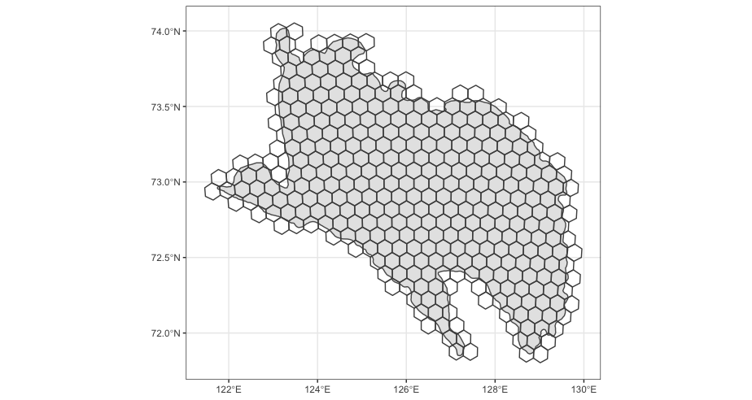

<style type="text/css">
.main-container {
  max-width: 1400px;
  margin-left: auto;
  margin-right: auto;
}
</style>

## Preliminary results (grid cell approach)

<details>
  <summary>R Library</summary>
```{r libraries, message=FALSE, warning=FALSE,  results=FALSE}
  library(stars)
  library(raster)
  library(tidyverse)
  library(sf)
  sf::sf_use_s2(FALSE)
```
</details><br/> 

### Grid
<details>
  <Grid code>R Library</summary>
```{r, message=FALSE, warning=FALSE}
load("data/tmp/roi.rda")

deltaCen <- st_centroid(roi) %>% st_coordinates()
proj <- glue::glue("+proj=laea +lon_0={deltaCen[,1]} +lat_0={deltaCen[,2]}")
chks     <- st_as_sfc(st_bbox(roi), crs = 4326) %>% st_transform(proj) %>%
  st_make_grid(cellsize = 11000, square = F) %>% st_transform(4326)
chks  <- chks[st_intersects(chks, roi %>% st_transform(st_crs(chks)), sparse = FALSE)[,1]]

ggplot() +
  geom_sf(roi, mapping = aes(geometry = geometry)) +
  geom_sf(chks, mapping = aes(geometry = geometry), col = "grey30", fill = NA) +
  theme_bw()
```
</details><br/> 



### Phenology

<details>
  <Grid code>R Library</summary>
```{r, eval = FALSE}
load("Output/deltaSum_small.rda") ## [classes, dates, index[ndvi, ndsi], chunks]
# dim(deltaSum$dat)
dts <- deltaSum$date
doy <- as.numeric(format(dts, "%j"))
yrs <- as.numeric(format(dts, "%Y"))

chks <- deltaSum$meta

plot(roi)
plot(chks, add = T)

phenChunk <- list()
# levels: chunks, class, year

for(chk in 1:dim(deltaSum$dat)[4]) {

  cat(sprintf('\rChunk %d of %d    ',
              chk, dim(deltaSum$dat)[4]))

chkDat <- deltaSum$dat[,,,chk]
# matplot(t(chkDat[,,2]), x = dts, pch = 16, cex = 0.7, type = 'p')

    phen <- abind::abind(lapply(1:11, function(c) {

      tryCatch({

        abind::abind(lapply(unique(yrs), function(y) {

          subY   <- which(yrs%in%c(y+c(-2:1,2)))
          subDOY <- doy[subY]
          dat  <- chkDat[c,subY,]
          w    <- scales::rescale(dnorm(yrs[subY] - y, 0, 0.75), to = c(0.1, 1))
          # matplot(dat, x = subDOY, type = "p", pch = 16)

          ## ndsi
          sn   <- rbind(cbind(subDOY, ifelse(dat[,2]<0.4, 0, 1), c(w)),
                        cbind(c(1:50, 300:365), 1, 1))

          mle   <- lsatFitGauss(sn[!is.na(sn[,2]),])
          # plot(sn[,1:2], pch = 16, col = c(mapply(adjustcolor, col = "cornflowerblue", alpha.f = sn[,3])))
          fit   <- gauss.curve(mle)
          # lines(1:365, fit, col = "red")
          sPhen <- sapply(c(0.9, 0.5, 0.1), function(x) GetThresh(x, 1-fit, TRUE, TRUE))
          # abline(v = sPhen[,1])
          # sPhen

          ## ndvi
          ev   <- rbind(cbind(c(subDOY),  ifelse(dat[,1]<0.05, 0, dat[,1]), c(w)),
                        cbind(c(1:50, 300:365), 0, 1))
          ev[subDOY%in%which(fit>0.9),2] <- 0
          ev <- ev[!is.na(ev[,2]),]
          # plot(ev[,1:2], pch = 16, col = c(mapply(adjustcolor, col = "darkgreen", alpha.f = ev[,3])))

          spl     <- smooth.spline(x = ev[,1], y = ev[,2], w = ev[,3], spar = 0.6)
          xSmooth <- predict(spl, 1:365)$y
          xSmooth[xSmooth<0] <- 0

          # lines(xSmooth, lwd = 2, col = "orange")
          peaks   <- FindPeaks(xSmooth)
          peaks   <- peaks[xSmooth[peaks]>0.15]
          # abline(v = peaks, lty = 3)

          pars    <- list(rel_amp_frac = 0, rel_peak_frac = 0, min_seg_amplitude = 0.075)
          segs    <- tryCatch(do.call("rbind", GetSegs(peaks, xSmooth, pars)), error = function(e) NULL)
          # apply(segs, 1, function(x) rect(c(1:365)[x[1]], 0, c(1:365)[x[3]], 1, col = adjustcolor("grey80", alpha.f = 0.2), border =  "grey10"))

          if(!is.null(segs)) {

            if(nrow(segs)>1) {

              max_in   <- min(segs[order(xSmooth[segs[,2]], decreasing = T),2][1:2])
              max_out  <- max(segs[order(xSmooth[segs[,2]], decreasing = T),2][1:2])

              seqRan   <- c(min(segs[order(xSmooth[segs[,2]], decreasing = T),1]),
                            max(segs[order(xSmooth[segs[,2]], decreasing = T),3]))

            } else {

              max_in <- max_out  <- segs[2]
              seqRan <- segs[c(1,3)]

            }
            dtsSm  <- 1:365
            max    <- dtsSm[max_in]
            # abline(v = dtsSm[max_in], lty = 3, col = "red", lwd = 3)
            amp    <- diff(range(xSmooth[seqRan[1]:seqRan[2]]))

            q10gup <- with(data.frame(t = dtsSm, y = xSmooth)[seqRan[1]:max_in,],  rev(t)[GetThresh(min(y) + diff(range(y))*0.1, rev(y), gup = F, first_greater = T)])
            # abline(h = with(data.frame(t = dtsSm, y = xSmooth)[seqRan[1]:max_in,], min(y) + diff(range(y))*0.1), v = q10gup, col = "blue")
            q90gup <- with(data.frame(t = dtsSm, y = xSmooth)[seqRan[1]:max_in,],  rev(t)[GetThresh(max(y) - diff(range(y))*0.1, rev(y), gup = F, first_greater = T)])
            # abline(h = with(data.frame(t = dtsSm, y = xSmooth)[seqRan[1]:max_in,], max(y) - diff(range(y))*0.1), v = q90gup, col = "firebrick")

            q90sen <- with(data.frame(t = dtsSm, y = xSmooth)[max_out:seqRan[2],],  rev(t)[GetThresh(max(y) - diff(range(y))*0.1, rev(y), gup = T, first_greater = F)])
            # abline(h = with(data.frame(t = dtsSm, y = xSmooth)[max_out:seqRan[2],], max(y) - diff(range(y))*0.1), v = q90sen, col = "blue")

            area   <- with(data.frame(t = q10gup:q90sen, y = xSmooth[q10gup:q90sen]),
                           MESS::auc(t, y, type = 'linear'))

            ePhen <- round(c(amp, q10gup, q90gup, max, q90sen, area),2)
          }  else {
            ePhen <- rep(NA, 6)
          }

          array(c(sPhen, ePhen), dim = c(1, 9))

         }), along = 3)

      }, error = function(e) array(dim = c(1,9,length(unique(yrs)))))

    }), along = 1)

phenChunk[[chk]] <- phen
}
```
</details><br/> 

<details>
  <Grid code>R Library</summary>
```{r, eval = FALSE}
  phenTab <- do.call("rbind", lapply(1:length(phenChunk), function(x) {
  do.call("rbind", lapply(1:9, function(t) {
    tibble(chunk = x, type = t, habitat = as.factor(rep(1:11, dim(tmp)[2])), year = rep(2000:2021, each = dim(tmp)[1]), val = c(phenChunk[[x]][,t,]))
  }))
}))


names <- c("sm90", "sm50", "sm10", "amp", "q10g", "q90g", "max", "q90s", "area")
descr <- c("snow melt timing (10%) [yday]",
           "snow melt timing (50%) [yday]",
           "snow melt timing (90%) [yday]",
           "ndvi amplitude [ndvi]",
           "greenup (10%) [yday]",
           "greenup (90%) [yday]",
           "max [ndvi]",
           "greendown (10%) [yday]",
           "auc (gup10% - sen10%) [ndvi]")
units <- c("yday", "yday", "yday", "ndvi", "yday", "yday", "yday", "yday", "ndvi")

lmTrendAll <- phenTab %>% group_by(chunk, type) %>%
  summarise(trend = tryCatch(summary(lm(val~year))$coefficients[2,1], error = function(e) NA))

pl <- lapply(c(3,2,1,5,6,4,9), function(t) {
  # cat(t)
  
  medPlot <- deltaSum$meta %>% st_as_sf() %>% bind_cols(
    phenTab %>% filter(type==t) %>% group_by(chunk) %>% summarise(median = median(val, na.rm = T)) %>% select(median))
  
  scale <- quantile(medPlot$median, probs = c(0.01, 0.99), na.rm = T)
  if(t%in%c(4,9)) {
    cols = viridis::viridis(20)
  } else cols = viridis::rocket(20)
  
  p1 <- ggplot(medPlot) +
    geom_sf(mapping = aes(fill = median), size = 0.3) +
    scale_fill_gradientn(colors =cols,
                         breaks = round(seq(scale[1], scale[2], length = 5),3),
                         limits = scale[c(1,2)], name = units[t]) +
    labs(x = "", y = "",
         title = "median (2000-2021)",
         tag = "A") +
    theme(
      axis.text.x  = element_text(size = 10),
      axis.text.y  = element_text(size = 10),
      title        = element_text(size = 13),
      panel.grid.major = element_blank(), panel.grid.minor = element_blank(),
      panel.background = element_rect(fill = "grey40",
                                      colour = "grey40"),
      panel.border     = element_rect(colour = "black", fill = "transparent"),
      panel.grid       = element_line(size = 0.08)
    )  +
    coord_sf(
      xlim = c(st_bbox(roi)["xmin"]+0.25, st_bbox(roi)["xmax"]+0.1),
      ylim = c(st_bbox(roi)["ymin"], st_bbox(roi)["ymax"]-0.1)
    )
  
  
  p2 <- ggplot(phenTab %>% filter(type==t)) +
    geom_boxplot(aes(x=habitat, y = val), fill = classCol[1:11]) +
    theme_bw() +
    labs(x = "Habitat class", y = descr[t],
         title = "",
         tag = "B") +
    theme(
      axis.text.x  = element_text(size = 10),
      axis.text.y  = element_text(size = 10),
      title        = element_text(size = 13)
    )
  
  p3 <- ggplot(phenTab %>% filter(type==t), mapping = aes(x = year, y = val, fill = habitat, col = habitat)) +
    geom_point(alpha = 0.05, shape = 16, show.legend = F) +
    geom_smooth(method = "gam", formula = y ~ s(x, bs = "cs"), se = T, show.legend = F) +
    scale_color_manual(values = classCol[1:11]) + 
    theme_bw() +
    labs(x = "Years", y = "",
         title = "",
         tag = "C") +
    theme(
      axis.text.x  = element_text(size = 10),
      axis.text.y  = element_text(size = 10),
      title        = element_text(size = 13)
    )

  
  lmTrend <- deltaSum$meta %>% st_as_sf() %>% bind_cols(trend = lmTrendAll %>% filter(type==t) %>% 
                                                        pull(trend)) %>% filter(!is.na(trend))
              
  bins    <- seq(-abs(max(lmTrend$trend)), abs(max(lmTrend$trend)), length = 50)
  lmBar   <- lmTrend %>% as_tibble() %>% mutate(gr = cut(trend, bins, labels = FALSE)) %>%
             group_by(gr) %>% summarise(f = n()) %>% full_join(tibble(gr = 1:length(bins), bins = bins)) %>% 
             arrange(gr)
  
  p4 <- ggplot(lmBar %>% mutate(f = ifelse(is.na(f), 0, f))) +
    geom_col(aes(bins, f, fill = gr), show.legend = F) +
      theme_bw() +
      scale_fill_gradientn(colors = grDevices::colorRampPalette(c("blue", "white", "red"))(length(bins))) +
      labs(x = "Trend (slope)", y = "",
           title = "",
           tag = "D") +
      theme(
        axis.text.x  = element_text(size = 10),
        axis.text.y  = element_text(size = 10),
        title        = element_text(size = 13)
      )
  
  
  
  if(t%in%c(4,9)) {
    scale = quantile(lmTrendAll %>% filter(type==t) %>% pull(trend), probs = c(0.01, 0.99), na.rm = T)
  } else scale = quantile(lmTrendAll %>% filter(type!=4 & type!=9) %>% pull(trend), probs = c(0.01, 0.99), na.rm = T)
  bins    <- seq(-abs(max(scale)), abs(max(scale)), length = 10)
  
  p5 <- ggplot(lmTrend) +
    geom_sf(mapping = aes(fill = trend), size = 0.3) +
    scale_fill_steps2(low = "blue", mid = "white", high = "brown",
                      breaks = round(bins, 4),
                      limits = c(-abs(max(scale)), abs(max(scale))),
                      name = paste0(units[t], "/year")) +
    labs(x = "", y = "",
         title = "Trend (linear slope)",
         tag = "E") +
    theme(
      axis.text.x  = element_text(size = 10),
      axis.text.y  = element_text(size = 10),
      title        = element_text(size = 13),
      panel.grid.major = element_blank(), panel.grid.minor = element_blank(),
      panel.background = element_rect(fill = "grey40",
                                      colour = "grey40"),
      panel.border     = element_rect(colour = "black", fill = "transparent"),
      panel.grid       = element_line(size = 0.08)
    )  +
    coord_sf(
      xlim = c(st_bbox(roi)["xmin"]+0.25, st_bbox(roi)["xmax"]+0.1),
      ylim = c(st_bbox(roi)["ymin"], st_bbox(roi)["ymax"]-0.1)
    )
  
  # png(glue::glue("Figures/{names[t]}.png"), width = 4000, height = 800, res = 200)
  p <- gridExtra::grid.arrange(p1, p2, p3, p4, p5, nrow = 1, 
                               left = grid:::textGrob(descr[t], just = "centre", rot = 90, gp = grid:::gpar(col="grey10", fontsize = 17)))
  # p
  # dev.off()
})

png(glue::glue("Figures/smallGrid.png"), width = 4700, height = 800*length(pl), res = 200)
do.call("grid.arrange", c(pl, ncol = 1))
dev.off()

```
</details><br/> 


